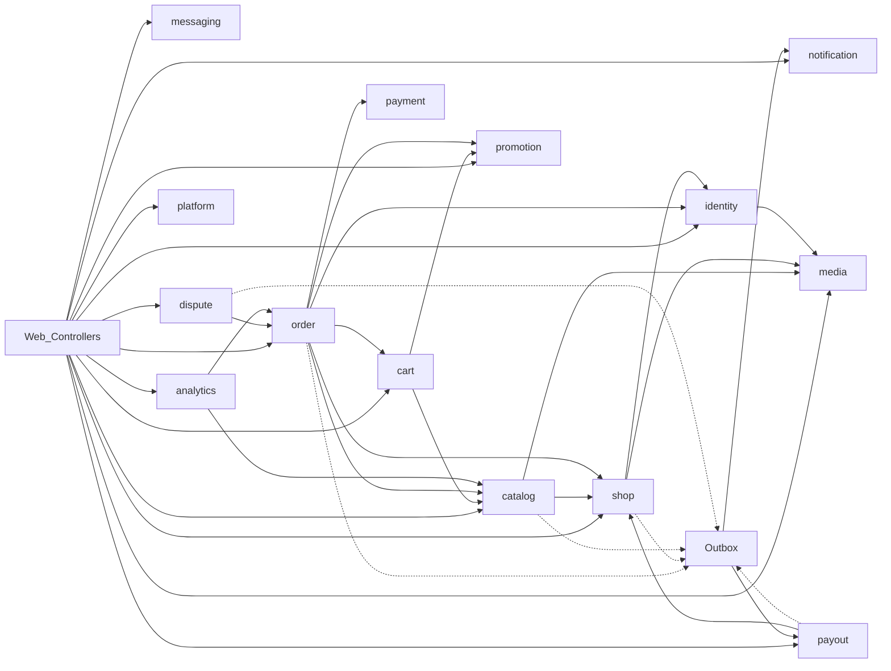

# ShopHub v2 — Backend Scope

This document is the approved architecture and implementation plan for `shophub-BE`.
Frontend source of truth: `shophub-FE`. Implement **one phase at a time**.

Backend path: `shophub_v2/shophub-BE`

---
# ShopHub v2 Backend Architecture Plan

**Source of truth:** [shophub_v2/shophub-FE](shophub_v2/shophub-FE) (Bolt mock SPA). It has no API client; every mutation is local/no-op. This plan designs the backend those screens imply.

**Not an incident platform.** The prompt’s incident examples are adapted to this marketplace (buyer / seller / admin).

**Proposed location:** `shophub_v2/shophub-BE` — one Gradle/Maven Spring Boot app (`com.shophub`). Frontend stays as-is until a later wiring phase.

**Existing v1 ([shophub](shophub/)) is not the spec.** v1 uses MySQL, umbrella+sub-orders, and a richer fulfillment model. v2 FE is simpler (one `sellerId` per order, product-level stock, display-only variants). Do not copy v1 tables or APIs unless they match this UI.

---

## 1. Requirements analysis

Three portals from routes in [App.tsx](shophub_v2/shophub-FE/src/App.tsx):

- **Buyer** — browse, cart, checkout, orders, wishlist, addresses, account, messages, notifications, help
- **Seller** — dashboard, products CRUD, orders/fulfillment, analytics, payouts, messages, store profile
- **Admin** — dashboard, catalog/users/sellers/applications, orders, disputes, coupons, platform settings

Auth is role-gated in the UI (`/login/:role`, `/register/:role`; admin cannot register). Credentials are not validated today.

**Out of scope until the FE grows (nav exists, no screen/data):** `/account/payments`, `/seller/settings/billing`, `/seller/settings/security`, `/seller/support`, `/seller/guide`, gift cards, 2FA/API-keys UI, newsletter persistence, live help-chat widget, “Upgrade Pro” checkout.

---

## 2. Frontend → backend mapping

Format: **Screen** → action → API → module → tables → auth → realtime → async

### Auth
- **Login picker / role login** → submit email+password (+ keep signed in) → `POST /api/v1/auth/login` → Identity → `users`, `refresh_tokens` → public; reject if `role` ≠ portal → none → none
- **Register buyer/seller** → create account (+ store name if seller) → `POST /api/v1/auth/register` → Identity + Shop → `users`, `shops`, `seller_applications` → public; no admin register → none → email welcome (async)
- **Forgot password** → send reset → `POST /api/v1/auth/forgot-password` → Identity → `password_reset_tokens` → public → none → email (async, always 200)
- **Reset password** (email link; FE only shows “check inbox”) → `POST /api/v1/auth/reset-password` → Identity → `users`, tokens → public → none → none
- **Sign out** → `POST /api/v1/auth/logout` → Identity → revoke refresh → authenticated → none → none

### Buyer storefront
- **Home** → featured/deals/trending/categories → `GET /api/v1/catalog/home` → Catalog → `products`, `categories` → public → none → none (Redis cache)
- **Shop** → filter/sort (`category`, `q`, `deals`, price, sort) → `GET /api/v1/catalog/products` → Catalog → `products`, `categories` → public → none → none
- **Product detail** → view → `GET /api/v1/catalog/products/{idOrSlug}` → Catalog → `products`, `product_images`, `product_variants`, `shops` → public → none → none
- **Product** → add to cart → `POST /api/v1/cart/items` → Cart → `carts`, `cart_items` → buyer → none → none
- **Product** → buy now → same + client navigates checkout
- **Product** → wishlist heart → `PUT /api/v1/wishlist/{productId}` → Cart → `wishlist_items` → buyer → none → none
- **Product** → reviews list / write / helpful → `GET/POST /api/v1/catalog/products/{id}/reviews`, `POST .../reviews/{id}/helpful` → Catalog → `reviews`, `review_helpful` → read public; write buyer (verified if purchased) → none → notify seller (async)
- **Cart** → qty/remove/coupon preview → `GET/PATCH/DELETE /api/v1/cart/...`, `POST /api/v1/cart/quote` → Cart + Promotion → `cart_items`, `coupons` → buyer → none → none
- **Checkout** → place order (address, delivery, payment) → `POST /api/v1/checkout` (Idempotency-Key) → Order + Payment + Catalog → `orders`, `order_items`, `payments`, `products.stock` → buyer → none → email + in-app notif (async after commit)
- **Orders list/detail** → search/filter, cancel, track → `GET /api/v1/orders`, `GET /api/v1/orders/{id}`, `POST /api/v1/orders/{id}/cancel` → Order → `orders`, `order_items`, `order_status_history` → buyer (own) → none → notify seller on cancel
- **Order** → request return → `POST /api/v1/disputes` → Dispute → `disputes` → buyer; order delivered → none → notify admin/seller
- **Wishlist / Addresses / Account profile / settings** → CRUD → `/api/v1/wishlist`, `/api/v1/addresses`, `/api/v1/me` → Identity/Cart → matching tables → buyer → none → none
- **Notifications** → list / mark read → `GET/PATCH /api/v1/notifications` → Notification → `notifications` → owner → optional poll unread → none
- **Messages** → list/send → `GET/POST /api/v1/conversations/...` → Messaging → `conversations`, `messages` → buyer/seller → optional poll → none
- **Help** → static FE; contact support → `POST /api/v1/conversations` with support shop/user → Messaging → same → buyer → none → none

### Seller
- **Dashboard / analytics** → `GET /api/v1/seller/dashboard`, `GET /api/v1/seller/analytics?period=` → Analytics → queries on `orders`, `products` → seller (own shop) → none → none
- **Products list/create/edit/delete** → `/api/v1/seller/products` → Catalog → `products`, images, variants → seller; shop must be verified to publish → none → none
- **Publish product** → status `pending` → Catalog → `products` → seller → none → notify admins (async)
- **Orders list/detail** → mark shipped/delivered/cancel → `POST /api/v1/seller/orders/{id}/ship` etc. → Order → `orders`, history, `tracking_number` → seller own shop → none → notify buyer
- **Payouts** → list, withdraw, methods → `/api/v1/seller/payouts`, `/api/v1/seller/payout-methods` → Payout → `seller_balances`, `payouts`, `payout_methods` → seller → none → payout job (async)
- **Store settings** → `GET/PUT /api/v1/seller/shop` → Shop → `shops` + media → seller → none → none

### Admin
- **Dashboard** → `GET /api/v1/admin/dashboard` → Analytics → aggregates → admin → none → none
- **Products** → list/moderate (view; edit = catalog update or reject) → `/api/v1/admin/products` → Catalog → `products` → admin → none → notify seller
- **Categories** → CRUD → `/api/v1/admin/categories` → Catalog → `categories` → admin → none → none
- **Users** → list, ban/unban → `/api/v1/admin/users/{id}/ban` → Identity → `users` → admin → none → none
- **Sellers + applications** → approve/reject → `POST /api/v1/admin/applications/{id}/approve|reject` → Shop → `seller_applications`, `shops`, `users.role` → admin → none → email seller
- **Orders** → list/detail (read) → `/api/v1/admin/orders` → Order → `orders` → admin → none → none
- **Disputes** → resolve buyer/seller, request info → `/api/v1/admin/disputes/{id}/...` → Dispute → `disputes`, maybe `orders.payment_status` → admin → none → notify parties; refund async if buyer favor
- **Coupons** → CRUD → `/api/v1/admin/coupons` → Promotion → `coupons` → admin → none → none
- **Settings** → `GET/PUT /api/v1/admin/settings` → Platform → `platform_settings` → admin → none → none

**Realtime:** FE badges/unread/online are static. No live dashboard. **Do not add WebSockets in v1.** Unread counts: `GET /api/v1/notifications/unread-count` (client may poll 30s). Revisit WS only if FE is later wired for live chat/tracking.

---

## 3. Architecture

```text
Browser
  → Nginx (static FE + /api + /media)
    → Spring Boot modular monolith (one process)
      → PostgreSQL (source of truth)
      → Redis (cache, login rate limit) — optional degrade
      → MinIO (images)
      → MailHog (local SMTP)
```

- Java 21, Spring Boot 3.x, Spring Security, Spring Data JPA, Flyway, Actuator
- REST under `/api/v1`
- In-process Spring events + **transactional outbox** + `@Scheduled` poller (no Kafka)
- Module boundaries: package-by-domain + `api` vs `internal` + **ArchUnit** tests (no Gradle multi-module until extraction is real)

---

## 4. Domain modules

Each module owns tables, exposes interfaces in `*.api`, emits outbox events. Others depend on APIs only.



| Module | Responsibility | Owns | Public API | Depends on | Produces | Consumes |
|---|---|---|---|---|---|---|
| **shared** | errors, IDs, money, outbox types, security annotations | none | all | none | — | — |
| **identity** | register/login/JWT, profile, addresses, ban, password reset | users, tokens, addresses | `UserPort`, `AddressPort` | media | `UserRegistered`, `UserBanned` | — |
| **shop** | applications, shop profile, plan STANDARD/PRO | shops, seller_applications | `ShopPort` | identity, media | `ShopApproved`, `ShopRejected` | — |
| **catalog** | categories, products, stock, reviews | categories, products, images, variants, reviews | `ProductPort`, `StockPort` | shop, media | `ProductSubmitted`, `StockChanged`, `ReviewCreated` | `ShopApproved` (allow publish) |
| **promotion** | coupons validate/redeem | coupons, coupon_redemptions | `CouponPort` | — | — | — |
| **cart** | cart + wishlist | carts, cart_items, wishlist_items | `CartPort` | catalog, promotion | — | — |
| **payment** | mock card/PayPal/COD port | payments | `PaymentPort` | — | `PaymentCaptured`, `PaymentFailed` | — |
| **order** | checkout, status machine, snapshots | orders, order_items, order_status_history | `OrderPort` | catalog, cart, identity, shop, promotion, payment | `OrderPlaced`, `OrderShipped`, `OrderCancelled`, `OrderDelivered` | — |
| **dispute** | returns/disputes | disputes | — | order | `DisputeOpened`, `DisputeResolved` | — |
| **payout** | ledger + withdraw | seller_balances, ledger_entries, payouts, payout_methods | — | shop | `PayoutCompleted`, `PayoutFailed` | `OrderDelivered` (credit available), `DisputeResolved` (clawback) |
| **messaging** | buyer↔seller and support | conversations, messages | — | identity, shop | `MessageSent` | — |
| **notification** | in-app + email | notifications | `NotificationPort` (write via outbox preferred) | — | — | all domain events |
| **analytics** | seller/admin dashboards | none (SQL views/queries) | — | order, catalog, shop | — | — |
| **platform** | admin settings | platform_settings | `SettingsPort` | — | — | — |
| **media** | upload to MinIO | none (object keys on owners) | `MediaPort` | — | — | — |
| **audit** | who did what | audit_log | `AuditPort` | — | — | admin/seller sensitive commands |

**No circular deps:** Order does not import Payout/Dispute internals; those listen to outbox. Catalog does not import Order; verified-purchase reviews call `OrderPort.hasPurchased`.

---

## 5. Database (PostgreSQL)

**Why Postgres:** `NUMERIC` money, `JSONB` variants/tags, `tsvector` for shop search, arrays, partial unique indexes. Better fit than MySQL for this catalog.

Money: `NUMERIC(12,2)`. IDs: `UUID`. Timestamps: `timestamptz`. Optimistic lock: `version BIGINT`. Soft-delete only where the UI implies restore/history (`users.banned_at`, products stay `rejected`/`draft` rather than deleted). Physical delete for cart lines and unread-mark is fine.

**Enums as PostgreSQL enums or check constraints** matching FE strings.

### Tables (every table maps to a FE need)

**Identity**
- `users` — id, email UNIQUE, password_hash, full_name, role (`buyer|seller|admin`), avatar_key, phone, date_of_birth, gender, banned_at, deleted_at, created_at, updated_at, version
- `refresh_tokens` — id, user_id FK, token_hash UNIQUE, expires_at, revoked_at, created_at (Keep me signed in = longer TTL)
- `password_reset_tokens` — id, user_id, token_hash, expires_at, used_at
- `addresses` — id, user_id, label, name, line1, city, state, zip, country, phone, is_default, created_at, updated_at; **partial unique** `(user_id) WHERE is_default`

**Shop**
- `shops` — id, user_id UNIQUE FK, business_name, slug UNIQUE, logo_key, banner_key, tagline, description, email, phone, address, category_id, plan (`standard|pro`), status (`pending|verified|rejected`), commission_rate override nullable, rating_avg, total_sales, created_at, updated_at, version
- `seller_applications` — id, user_id FK, shop_id FK, business_name, applicant_name, email, category_id, status (`pending|approved|rejected`), submitted_at, reviewed_at, reviewer_id, reject_reason

**Catalog**
- `categories` — id, name, slug UNIQUE, icon, parent_id nullable (subcategories as children; FE has string list — store as child rows or `text[]`; **decision:** `categories` + `parent_id` so admin can add/edit)
- `products` — id, shop_id FK, title, slug UNIQUE, description, category_id, brand, price, compare_at, stock, status, sales_count, rating_avg, review_count, created_at, updated_at, version
- `product_tags` — product_id, tag (PK composite) **or** `products.tags TEXT[]`
- `product_images` — id, product_id, object_key, sort_order (0 = cover), max 5 enforced in app
- `product_variant_defs` — id, product_id, name, options `TEXT[]` (display only; **not** SKU inventory — matches FE)
- `reviews` — id, product_id, user_id, order_id nullable, rating 1–5, title, body, verified, helpful_count, created_at; unique `(product_id, user_id)`
- `review_helpful` — review_id, user_id PK

**Cart / wishlist**
- `carts` — id, user_id UNIQUE, coupon_code nullable, updated_at
- `cart_items` — id, cart_id, product_id, qty, variant_label nullable, unique `(cart_id, product_id, variant_label)`
- `wishlist_items` — user_id, product_id, added_at PK

**Promotion**
- `coupons` — id, code UNIQUE, type `percent|fixed`, value, usage_limit, used_count, expires_at, status, created_at, updated_at
- `coupon_redemptions` — id, coupon_id, user_id, order_id, created_at; unique `(coupon_id, user_id)` if one-per-user (assumption: usage_limit is global count as FE shows)

**Order / payment**
- `checkouts` — id, buyer_id, checkout_number (`SH-2024-10045`), address snapshot JSON, delivery_method `standard|express|pickup`, payment_method `card|paypal|cod`, coupon_id, subtotal, shipping, tax, total, created_at (**needed:** FE success shows one number; cart may mix shops)
- `orders` — id, checkout_id, order_number UNIQUE, buyer_id, shop_id, status, payment_status, subtotal, shipping, tax, total, shipping_address JSONB, tracking_number, placed_at, updated_at, version
- `order_items` — id, order_id, product_id, title, image_key, unit_price, qty, variant_label (snapshot)
- `order_status_history` — id, order_id, from_status, to_status, actor_id, created_at
- `payments` — id, checkout_id, provider `mock_card|mock_paypal|cod`, status, amount, provider_ref, created_at

**Dispute / payout / messaging / notification / platform**
- `disputes` — id, order_id FK, checkout_id, buyer_id, shop_id, reason, status, amount, opened_at, resolved_at, resolution `buyer|seller|null`, notes
- `seller_balances` — shop_id PK, available, pending, updated_at, version
- `ledger_entries` — id, shop_id, order_id nullable, payout_id nullable, type `credit_pending|release_available|clawback|payout`, amount, created_at
- `payouts` — id, shop_id, amount, status, method_id, created_at, processed_at, failure_reason
- `payout_methods` — id, shop_id, type `bank|paypal`, masked_display, details_encrypted, is_default
- `conversations` — id, buyer_id, shop_id nullable, support boolean, created_at, last_message_at
- `messages` — id, conversation_id, sender_id, body, created_at
- `notifications` — id, user_id, type, title, body, read_at, entity_type, entity_id, created_at
- `platform_settings` — key PK, value JSONB, updated_at (name, support_email, currency, timezone, commission_default, commission_pro, min_payout, admin_notif flags)
- `outbox` — id, event_type, payload JSONB, created_at, published_at, attempts
- `audit_log` — id, actor_id, action, entity_type, entity_id, diff JSONB, created_at
- `idempotency_keys` — key PK, user_id, response_hash, created_at (checkout)

**Relationships:** User 1–1 Shop; Shop 1–N Products; User 1–N Addresses/Orders; Checkout 1–N Orders; Order 1–N Items; Product 1–N Reviews; Order 1–N Disputes; Shop 1–1 Balance.

**Indexes:** `products(status, category_id)`, GIN/tsvector on title+description, `orders(buyer_id, placed_at)`, `orders(shop_id, status)`, `notifications(user_id, read_at)`, `outbox(published_at)` where null.

---

## 6. Flyway plan (schema only)

Do not mix demo SQL into these.

1. `V1__identity.sql` — users, tokens, addresses
2. `V2__shop.sql` — shops, applications (FK users)
3. `V3__catalog.sql` — categories, products, images, variants, tags, reviews
4. `V4__promotion.sql` — coupons, redemptions
5. `V5__cart.sql` — carts, items, wishlist
6. `V6__order.sql` — checkouts, orders, items, history, payments, idempotency
7. `V7__dispute.sql`
8. `V8__payout.sql` — balances, ledger, payouts, methods
9. `V9__messaging.sql`
10. `V10__notification.sql`
11. `V11__platform_outbox_audit.sql`

**Seed:** not Flyway. `DemoDataLoader` on profile `demo` if `users` empty — categories, products, three accounts (`alex@` / `seller@` / `admin@shophub.com`, password `demo1234`), addresses, orders, disputes, coupons (`WELCOME10`, `FREESHIP`, `SUMMER25`), conversations, notifications. Matches [LoginPage](shophub_v2/shophub-FE/src/pages/auth/LoginPage.tsx) prefills.

---

## 7. API design (representative)

Prefix `/api/v1`. Auth: Bearer access JWT except auth + public catalog. Errors: section 15. Idempotency: `Idempotency-Key` on `POST /checkout` and `POST /payouts`.

**Auth:** `POST /auth/login` `{email,password,role,rememberMe}` → `{accessToken,refreshToken,user}`; 401 bad creds, 403 wrong portal role. `POST /auth/register`, `/auth/refresh`, `/auth/logout`, `/auth/forgot-password`, `/auth/reset-password`.

**Me:** `GET/PATCH /me`, `POST /me/password`, `DELETE /me` (anonymize).

**Addresses:** `GET/POST /addresses`, `PUT/DELETE /addresses/{id}`, `POST /addresses/{id}/default`.

**Catalog public:** `GET /catalog/home`, `/catalog/categories`, `/catalog/products` (query: q, category, minPrice, maxPrice, deals, sort=`featured|price_asc|price_desc|rating|newest`, page), `/catalog/products/{idOrSlug}`, `/catalog/products/{id}/reviews`.

**Cart:** `GET /cart`, `PUT /cart/items` `{productId,qty,variant}`, `DELETE /cart/items/{id}`, `POST /cart/coupon` `{code}`, `DELETE /cart/coupon`.

**Checkout:** `POST /checkout` `{addressId, deliveryMethod, paymentMethod, paymentToken?}`. 400 empty/invalid, 409 stock, 402 payment failed. Creates checkout + per-shop orders, decrements stock, clears cart. Async: confirmation email + notifications.

**Orders buyer:** `GET /orders`, `GET /orders/{id}`, `POST /orders/{id}/cancel`.

**Seller products/orders/shop/payouts/dashboard** under `/seller/...` with `SHOP_OWNER` checks.

**Admin** under `/admin/...`.

**Messages:** `GET /conversations`, `GET /conversations/{id}/messages`, `POST /conversations` `{shopId|support}`, `POST /conversations/{id}/messages` `{text}`.

**Notifications:** `GET /notifications`, `POST /notifications/read-all`, `PATCH /notifications/{id}/read`, `GET /notifications/unread-count`.

**Media:** `POST /media` multipart (purpose=`product|avatar|banner|logo`) → `{key,url}`; size/type limits (avatar 2MB per FE copy).

Full request/response DTOs implemented per phase to match FE fields (product title, compareAt, tags, variants name/options, etc.).

---

## 8. AuthN / AuthZ

- BCrypt passwords; never log them
- Access JWT ~15m (claims: sub, role, shopId if seller); refresh 7d or 30d if rememberMe; rotate refresh
- Role is **one per user** (FE uses three emails). Buyer registers as buyer; seller register creates user role=seller + shop+application. Approving application sets shop `verified`. **Do not** merge alex+seller into one user (FE mock `SELLER_PROFILE.userId = u1` is inconsistent with three logins).
- Method security on permissions (not scattered `if role`):

Permission set: `CATALOG_READ` (public), `CART_WRITE`, `ORDER_CREATE`, `ORDER_CANCEL_OWN`, `REVIEW_WRITE`, `SHOP_MANAGE`, `PRODUCT_MANAGE`, `ORDER_FULFILL`, `PAYOUT_MANAGE`, `CONVERSATION_WRITE`, `ADMIN_USERS`, `ADMIN_MODERATE_PRODUCT`, `ADMIN_MODERATE_SHOP`, `ADMIN_DISPUTE`, `ADMIN_COUPON`, `ADMIN_SETTINGS`, `ADMIN_ORDERS_READ`.

Matrix (FE roles only):
- **Buyer:** view catalog, cart, checkout, own orders/cancel, reviews, wishlist, addresses, messages, notifications
- **Seller:** buyer-catalog read + own shop products, fulfill own orders, payouts, analytics, messages
- **Admin:** all admin + catalog read; not used as a buyer unless we later add it (FE admin portal is separate)

Ban: `banned_at` set → 403 on login and authenticated requests.

---

## 9. Business rules

**Product status:** `draft` → `pending` (publish) → `active` (admin approve) or `rejected`. Seller may return rejected → draft. Only `active` + stock>0 appear in shop. Admin can unpublish to rejected.

**Order status (reject invalid with 400 `INVALID_STATE_TRANSITION`):**

```text
pending → processing | cancelled
processing → shipped | cancelled
shipped → delivered
delivered → (terminal for fulfillment)
any except refunded → refunded (admin/dispute only)
cancelled, refunded: terminal
```

Buyer cancel: only `pending|processing`. Seller cancel: same. Seller ship: `processing` + tracking optional. Seller deliver: `shipped`.

**Payment:** card/PayPal mock capture sync in checkout (success unless test PAN). COD: `payment_status=pending` until delivered then `paid`. Failed card: no order, stock not decremented.

**Pricing (from FE):** tax = 8% of merchandise subtotal; shipping standard 0 / express 15 / pickup 5; cart free-ship copy “over $50” applies to **cart page quote only** if we implement the same rule (checkout uses delivery method prices — **conflict:** cart says free >$50, checkout standard is always free. **Backend:** checkout shipping from delivery method; cart quote uses same as checkout default `standard` = 0, and can show free-ship message as FE copy without a second rule).

**Commission:** snapshot on order: `standard` → settings.default 8%, `pro` → 5%. Seller earnings UI uses `subtotal * (1-rate)` (FE 0.92). Credit **pending** on `processing`/`paid`; **available** on `delivered`. Min payout from settings (default 50).

**Coupon:** active, not expired, `used_count < usage_limit`; percent off subtotal or fixed; cart `WELCOME10` is 10% — validate against table not a hardcoded 10%.

**Stock:** product-level (FE has one stock). Variant is a label on the line, does not split inventory.

**Reviews:** one per user per product; `verified` if delivered order contains product.

**Default address:** exactly one default; setting new default unset others in one transaction.

**Seller apply:** register seller → application `pending`, shop `pending`; cannot publish until verified.

---

## 10. Concurrency

| Operation | Mechanism |
|---|---|
| Checkout stock | single TX; `UPDATE products SET stock = stock - :qty WHERE id=:id AND stock >= :qty AND version=:v` or `stock >= qty` returning; fail 409 if 0 rows |
| Checkout duplicate submit | `idempotency_keys` unique + same response |
| Coupon used_count | `UPDATE ... SET used_count = used_count+1 WHERE used_count < usage_limit` |
| Order status | optimistic `@Version`; 409 on stale |
| Default address | TX + partial unique index |
| Payout withdraw | optimistic on `seller_balances`; unique constraint prevent double pending if required; idempotency key |
| Ban user | simple update; JWT still valid until expiry (short TTL) or optional Redis denylist |
| Product publish | version on product |

No pessimistic locks except if stock updates still race under proof tests — then `SELECT … FOR UPDATE` on product rows in checkout TX only.

---

## 11. Async / events

Prefer **outbox in same TX as the write**, then `OutboxPublisher` every few seconds. Processor: Spring `@Async` / single-thread scheduler. **No Kafka.**

| Work | Sync vs async | Failure |
|---|---|---|
| Stock + order insert + payment mock | **Sync** in checkout TX (payment mock is local) | rollback all |
| Email (welcome, reset, order, dispute) | Async from outbox | retry exponential; MailHog locally; dead-letter after N; user-visible reset still returns 200 |
| In-app notification rows | **Sync in same TX** as order (so UI sees them immediately) **or** outbox-immediate; choose **same TX insert** for order-related notifs (simple, reliable) |
| Admin “daily revenue summary” | `@Scheduled` cron | log + metric; no user request |
| Payout processing | Async job: pending → processing → completed | retry; `failed` + reason; seller sees status |
| Refund on dispute buyer-favor | Async after resolve | retry; don’t mark dispute resolved until refund recorded **or** resolve sync and job retries refund (document: resolve sync, refund job, dispute stays resolved) |

Duplicates: outbox `published_at` + processor idempotent (notification unique optional `(user_id, type, entity_id)` for order events).

---

## 12. Real-time

**v1 choice: REST.** FE has no sockets, no live tracking, static unread dots.

- Unread: poll `GET /notifications/unread-count`
- Chat: refetch on send; optional poll messages every 10s later
- If FE later needs live chat: STOMP/WebSocket on `/ws`, topic `/user/{id}/notifications`, JWT on connect, subscribe only own queues

---

## 13. API gateway

**Yes, Nginx in Compose — not a business gateway product.**

**Nginx:** TLS later; local HTTP; route `/` → FE, `/api/` → backend, `/media/` → MinIO; CORS unnecessary if same origin; `client_max_body_size` for uploads; `X-Request-Id`; gzip; rate-limit login path optionally (Redis in app is enough).

**Spring:** authz, validation, business rules, persistence.

Do not put order/checkout logic in Nginx.

---

## 14. Redis (justified only)

| Use | Key | TTL | If Redis down |
|---|---|---|---|
| Login rate limit | `rl:login:{email}` | 15m | fail-open with warning **or** in-memory fallback for single-node local |
| Home/catalog cache | `catalog:home` | 30–60s | skip cache, hit DB |
| Unread count | `notif:unread:{userId}` | 60s | count from DB |

Not for sessions (JWT), not source of truth, no distributed lock unless payout job is multi-instance later (Compose is one backend).

---

## 15. Observability and errors

- Actuator: `/actuator/health` (db, redis, minio, mail optional), `/actuator/prometheus` if we add Micrometer Prometheus (justified: one scrape in Compose **optional**; start with Actuator + structured JSON logs)
- Micrometer: HTTP latency, 4xx/5xx, checkout success/fail, stock conflicts, outbox lag, mail failures, payout failures
- `X-Request-Id` MDC on every log
- Grafana/Prometheus **not required for local demo**; add scrape later in hardening phase if metrics exist

**Error body:**

```json
{
  "timestamp": "...",
  "status": 409,
  "code": "INSUFFICIENT_STOCK",
  "message": "Not enough stock for product p1",
  "path": "/api/v1/checkout",
  "requestId": "...",
  "details": []
}
```

`@ControllerAdvice`: 400 validation, 401, 403, 404, 409 conflict/version/stock, 422 business, 500 generic (no stack to client).

---

## 16. Docker / local

Ports **offset from v1** so both can run: FE 8091, API 8082, Postgres 5433, Redis 6382, MinIO 9004/9005, MailHog 8027/1027.

```text
docker compose up --build
→ http://localhost:8091
```

Services: `frontend`, `backend`, `postgres`, `redis`, `minio`, `mailhog`, `nginx` (or FE served by nginx only).

Config via env: `SPRING_DATASOURCE_*`, `REDIS_URL`, `JWT_SECRET`, `MINIO_*`, `MAIL_HOST=mailhog`, `SPRING_PROFILES_ACTIVE=demo`.

---

## 17. Testing

Must-have scenarios:
- Login role portal mismatch; ban; refresh rotation
- Register seller cannot publish until approve
- Product state machine
- Checkout stock race (two threads, stock=1 → one 409)
- Checkout idempotency
- Invalid order transition 400
- Coupon over-limit
- Commission snapshot 8% vs pro 5%
- Dispute refund clawback
- Forgot-password does not reveal user existence
- Flyway migrate on empty DB
- ArchUnit: no `order.internal` import from `payout`

Stack: JUnit 5, Testcontainers Postgres, MockMvc/WebTestClient, `@DataJpaTest` where useful. E2E against Compose later.

---

## 18. Project structure

```text
shophub_v2/shophub-BE/
  src/main/java/com/shophub/
    ShopHubApplication.java
    identity/{api,application,domain,infrastructure,web}
    shop/...
    catalog/...
    cart/...
    promotion/...
    payment/{api,domain,infrastructure}  # MockPaymentAdapter
    order/...
    dispute/...
    payout/...
    messaging/...
    notification/...
    analytics/...
    platform/...
    media/...
    audit/...
    shared/{error,security,outbox,money}
  src/main/resources/db/migration/V*.sql
  src/test/java/... ArchUnit + module tests
  deploy/docker-compose.yml Dockerfile
```

---

## 19. Implementation phases

After approval, **one phase at a time**. Do not skip ahead. After each: tests, migrations, APIs, files changed, remaining work.

- **P0 Setup** — Boot app, Docker Postgres/Redis/MinIO/MailHog/Nginx skeleton, Actuator health, empty `/api/v1/health`
- **P1 Schema** — Flyway V1–V11, entity map, no business APIs yet
- **P2 Identity** — register/login/refresh/logout/forgot/reset, `/me`, addresses, RBAC, seed users
- **P3 Catalog** — categories, public product list/detail, seller product CRUD, admin moderate, MinIO images
- **P4 Cart + wishlist + coupons** — cart quote including tax/shipping preview
- **P5 Checkout + orders + payment mock + stock** — core money path
- **P6 Fulfillment** — seller/admin order actions, history, tracking
- **P7 Shop applications + admin users/ban + settings**
- **P8 Reviews, disputes, payouts**
- **P9 Messaging + notifications + email outbox**
- **P10 Analytics dashboards**
- **P11 Observability, rate limit, hardening, Compose one-command demo**
- **P12 FE wiring** (separate; not this backend plan’s first delivery) — replace `data.ts` with API client

P0–P2 acceptance: `compose up`, login as the three demo users, JWT to `/me`.

---

## 20. Backend assumptions / gaps

Required by UI but not specified as API:

1. **Multi-shop cart vs single-seller order** — FE `Order` has one `sellerId`; cart lines have `sellerId`. **Assumption:** one `checkout` (success number) + one `order` per shop. Seller UI sees shop orders; buyer order list is per-shop orders (or grouped later). If this conflicts with a future FE that shows one combined order, stop and reconcile.
2. **Payment** — no PSP. **Mock adapter** + COD; do not store PAN (accept dummy token / last4 only).
3. **Password reset complete** — FE has no token page. Provide `POST /reset-password` and a simple HTML or documented query link for MailHog.
4. **Request return** → create `dispute` (no Return entity in FE).
5. **Header search** does not pass `q` (FE bug). Backend still supports `q`.
6. **Shop search rating/in-stock filters** are unused in FE logic — still support `inStock` query for completeness? **No** — only wire filters the Shop page actually applies: category, price max, sort, deals, q.
7. **Pro plan** — layout “Upgrade Pro” unwired; admin has pro commission. Store `shops.plan`; changing plan is admin-only until FE exists.
8. **2FA / delete account** — delete implemented; 2FA **deferred** (settings toggle stored as preference only or omitted until FE is real).
9. **Invoice PDF** — FE “Print invoice” = client print; no PDF service.
10. **Analytics traffic sources / conversion** — FE charts are mock. **Assumption:** revenue/orders/top products from DB; traffic sources **omitted or zeros** until tracking exists — do not invent clickstream.
11. **Same-origin Nginx** so FE needs no CORS in demo.
12. **IPv4 Vite bind** already noted in FE `vite.config.ts`; Compose will bind `0.0.0.0`.

---

## 21. Risks / unresolved questions (need your call only if you disagree)

- Postgres vs MySQL (plan: Postgres)
- Checkout split vs single order (plan: split per shop + checkout number)
- WebSocket deferred
- Mock payments only
- Backend path `shophub_v2/shophub-BE`

**Stop here.** No code until you approve this plan (and any changes to the assumptions above). Then implement **P0 only**.
